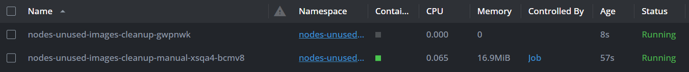
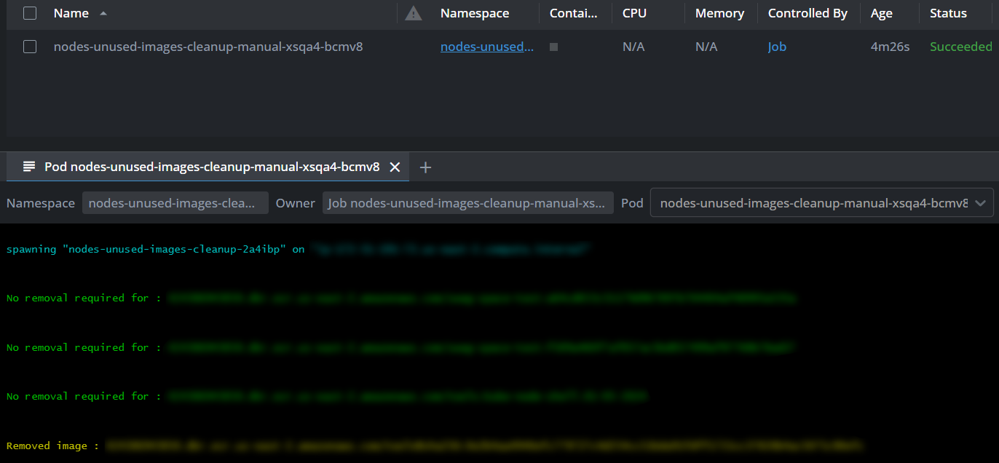
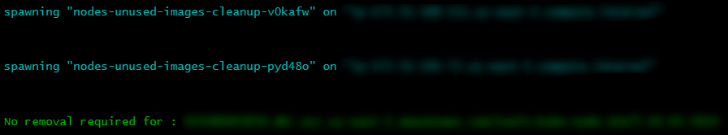
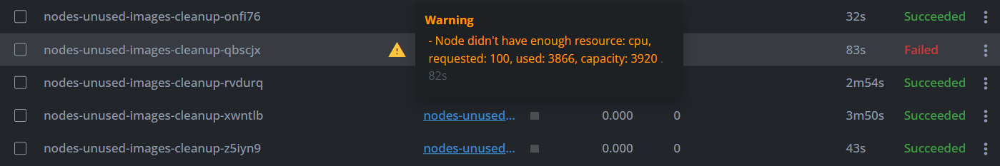

# 🔰 Introduction 🔰

* This `Helm chart` deploys a `CronJob` which deletes *all unused images on Kubernetes nodes* by the defined schedule. This approach helps to avoid `node disk pressure` issues (especially in case of frequent deployments) and improves overall memory usage.

# ⚙️ How it works ⚙️

* `CronJob` relies on the work of the script. It performs the following :

  * gets all nodes in the cluster;

  * in turn runs a **[kubectl node-shell](https://github.com/kvaps/kubectl-node-shell)** on each node :
    * `ctr` (containerd CLI) gets all images by defined pattern (uses `grep`);
    
    * if an image isn't associated with any container -> delete it, else -> do nothing;

  * modifies output to make it more beautiful and informative;

* When a `CronJob` is triggered, `Job` is created. Then new pods are spawned one by one (from `kubectl node-shell`). `Job` collects logs from those pods and outputs them to its log. As soon as the pod finishes its task, it automatically deletes. This continues until the script runs through all the nodes. As a result, we have one `Job` with all the needed logs.
 
* How the process looks like :
 
  

* `CronJob` execution results :
 
  

# 🧱 Chart resources 🧱

* `Helm chart` contains the following Kubernetes resources :

  * `CronJob`;

  * `ServiceAccount`;

  * `ClusterRole`;

  * `ClusterRoleBinding`.

# 🛩️ Usage guide 🛩️

* Clone the repository or download the **[Release](https://github.com/itsyndicate/nodes-unused-images-cleanup/releases)** you need.

* Set desired `container_cpu` & `container_memory` in the `kube-shell` (these are `resources` for the spawned pods by `kubectl node-shell`).

* Build the `Docker image` :

```
docker build -t ${NAME}:${TAG} .
```

* Push your image to the desired repository (AWS ECR, Docker Hub, etc).

* Adjust `values.yaml`. You **must** set the following :

  * `CronJob image`;

  * `grep` pattern for the `all_images` variable. For example, if you keep images in `AWS ECR`, you can grep them by `account id`.

* We also recommend setting the desired `schedule, ttlSecondsAfterFinished & resources` for the `CronJob`. Configure the rest `values.yaml` content as you wish.

* Generate `helm template` before deployment (set `release name / namespace` as you wish) :

```
helm template nodes-unused-images-cleanup .\nodes-unused-images-cleanup\ --create-namespace --namespace nodes-unused-images-cleanup --debug
```

* Deploy release (set `release name / namespace` as you wish) :

```
helm upgrade --install nodes-unused-images-cleanup .\nodes-unused-images-cleanup\ --create-namespace --namespace nodes-unused-images-cleanup --debug
```

# 🔎 Debug 🔎

> [!NOTE]
> This block will help you to investigate issues with `CronJob` execution.

* The most likely cause of the error below is `Node didn't have enough resource`. It can be `cpu, memory or pods`.

```
Error from server (BadRequest): container "nodes-unused-images-cleanup" in pod "nodes-unused-images-cleanup-sxvmq5" is not available
```

* No output after the `spawning` text tells about no images with defined `grep` criteria were found. Check the image below :

  

* The most likely cause of the error below is the container may have already completed and exited or the pod may have been deleted or restarted between the time the command was issued and the connection attempt was made. This means that the pod did his task, but `Job` wasn't able to get the logs from it.

```
warning: couldn't attach to pod/nodes-unused-images-cleanup-sc9qph, falling back to streaming logs: unable to upgrade connection: container nodes-unused-images-cleanup not found in pod nodes-unused-images-cleanup-sc9qph_nodes-unused-images-cleanup
```

> [!IMPORTANT]
> You can temporarily remove the `delete` rule for `pods` inside `ClusterRole` and run the `CronJob`. This helps to investigate the root cause of the errors inside `Job` logs because pods won't be automatically deleted. Check the image below.
>
> Don't forget to adjust `ClusterRole` and delete pods after testing.

  


# 💡 Contribution 💡

* We'll be very thankful for any ideas, improvements, bug reports, etc. Feel free to open `Issues` 🤗

# 📜 License 📜
* `Apache 2 Licensed`. See **[LICENSE](https://github.com/itsyndicate/nodes-unused-images-cleanup/blob/main/LICENSE)** for full details.

# 🛠️ Maintainers 🛠️

* **[plain5](https://github.com/plain5)**
